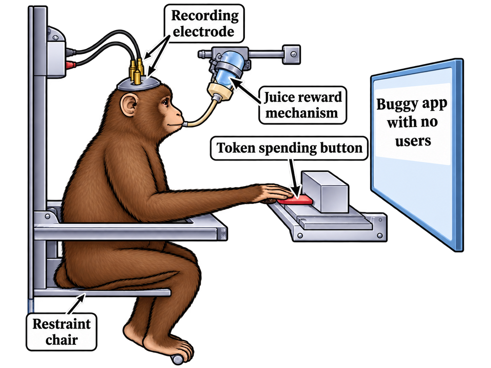
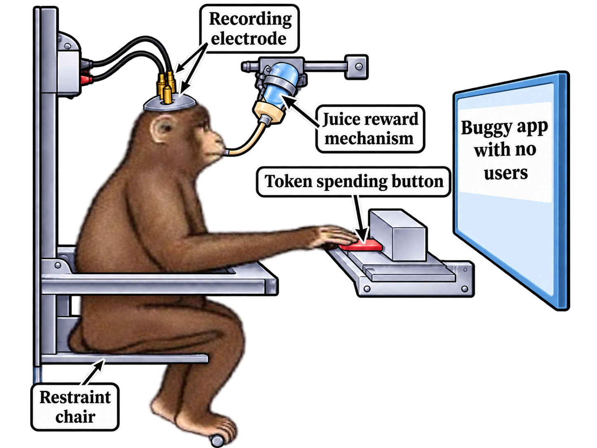

<h3>lakshya here!! 
  
  <h4>(im looking for an internship!)</h3>

<h4 align="center">
  <a href="mailto:lakshya@duck.com">mail me!</a>
  &nbsp;•&nbsp;
  <a href="https://www.linkedin.com/in/la-kshya/">linkedin</a>
  &nbsp;•&nbsp;
  <a href="https://portfolio.lakshya.lol">portfolio</a>
  &nbsp;•&nbsp;
  <a href="https://signal.me/#eu/KJOUtgou_IAbjezpus9gnTSiOEiUNgq-rVIXyTWeQuM12I1qZzJGCJYoaXBpDoy7">signal</a>
</h4>

<picture>
  <source media="(prefers-color-scheme: dark)" srcset="https://raw.githubusercontent.com/laksh-ya/laksh-ya/output/github-contribution-grid-snake-dark.svg">
  <source media="(prefers-color-scheme: light)" srcset="https://raw.githubusercontent.com/laksh-ya/laksh-ya/output/github-contribution-grid-snake.svg">
  
</picture>

 

 

1. clean monkey

<picture>
  <source media="(prefers-color-scheme: dark)" srcset="4-token-meme-hd-dark.png">
  <source media="(prefers-color-scheme: light)" srcset="3-token-meme-hd-light.png">
  
</picture>

2. derpy monkey

<picture>
  <source media="(prefers-color-scheme: dark)" srcset="6-derpy-meme-dark.png">
  <source media="(prefers-color-scheme: light)" srcset="5-derpy-meme-light.png">
  
</picture>

<h5 align="center">
 <a href="https://youtu.be/s0qc130R55Y?si=zP5KW7KVue1Cs888">
    bleh :3
  </a>  &nbsp;•&nbsp;
  <a href="https://www.lakshya.lol">lakshya.lol</a>
</h5>
